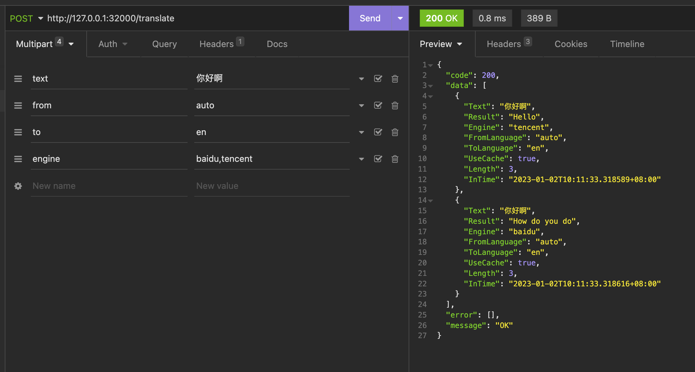

# transgo
一个多合一翻译接口聚合平台，支持`百度翻译`、`腾讯机器翻译`、`阿里云机器翻译`、`头条火山翻译`接口，提供cli和API接口两种查询方式，程序支持使用缓存，避免重复请求付费翻译接口，支持的缓存类型有`memory`、`redis`、`file`

## 接口文档
* [百度翻译](https://fanyi-api.baidu.com/doc/21)
* [腾讯机器翻译](https://cloud.tencent.com/document/product/551/15612)
* [阿里云机器翻译](https://help.aliyun.com/document_detail/215387.html?spm=a2c4g.11186623.0.0.67612e50Jf1003)
* [头条火山翻译](https://www.volcengine.com/docs/4640/65067)

## 安装
可使用`go install`命令
```
$ go install github.com/falcolee/transgo@latest
...
$ transgo -h
...
```

## 使用说明
初次启动时默认会在程序根目录下创建名为`transgo.yaml`配置文件，修改配置文件中接口配置即可

### 快速使用

**指定目录创建配置**

在当前用户根目录创建配置文件，程序会自动读取该目录下配置
```
transgo -k ~
```

**修改配置**
```
vim ~/transgo.yaml
```

**cli翻译**

```
transgo -w 你好啊 -e baidu
```


**启用API模式**

```
transgo --api
```
如果需要放在后台执行可以添加-d参数，如
```
transgo --api -d
```

**指定配置文件**

```
transgo -c /home/transgo.yaml --api
```

**翻译接口**

API模式启动后，默认开启32000端口，访问`http://127.0.0.1:3000`查看是否启动成功
  - 翻译接口地址:`http://127.0.0.1:31000/translate`
  - 方法: `POST`
  - 接口参数
    * text: 文本
    * from: 原始语言(可选参数，不填默认auto)
    * to 翻译的语言(可选参数，不填默认en)
    * engine 指定翻译引擎，支持多个用,分割(可选参数，不填则使用配置文件中默认引擎)
```
curl --request POST \
  --url http://127.0.0.1:31000/translate \
  --header 'Content-Type: multipart/form-data' \
  --form 'text=你好啊' \
  --form from=auto \
  --form to=en \
  --form 'engine=baidu,tencent'
```


### 详细参数说明
transgo -h
```
Options:

  -h, --help               display help information
  -e, --engine             指定翻译引擎，支持多个，如-e baidu -e qq
  -w, --text               要翻译的文本
  -i, --input              批量查询，文本按行分隔，输入txt路径
  -f, --from[=auto]        源语言，默认为自动
  -t, --to[=en]            翻译语言，默认为英文
  -a, --appid              翻译引擎接口账户，如appid,appkey等
  -s, --secret             翻译引擎接口秘钥，如appsecret,secretkey等
  -r, --region             部分翻译引擎提供地区(可选)
  -c, --config             配置文件路径，yaml文件
  -k, --config-dir         配置文件生成目录，默认读取目录(可选)
  -l, --delay              每个请求延迟（S）默认无延迟，-1为随机延迟1-5秒
  -v, --version            版本信息
  -u, --debug              是否显示debug详细信息
  -p, --api                是否API模式
  -d, --daemon             是否在后台运行，开启守护进程，仅在API模式中生效
  -x, --cache[=true]       是否启用缓存，默认启用
  -y, --split              开启分引擎缓存，各家引擎结果分别缓存
  -g, --storage[=memery]   缓存引擎，默认使用内存，支持memory/redis/file
  -z, --dir                如开启文件缓存，需指定文件缓存目录
```

### 配置文件范例
系统默认读取`$HOME`用户根目录或当前程序目录下的`transgo.yaml`
```
version: 0.1
cache:
  useCache: true       	# 开启缓存
  cacheStorage: 'file'	# 缓存类型，支持memory/file/redis
  storageDir: '/some/path/cache'			# 文件缓存目录
  redisAddr: ''			# redis连接地址，127.0.0.1:6379
  redisPassword: ''		# redis密码
  redisPrefix: ''
http:
  server: ':31000'      # API启动端口
engine:
  default: 'baidu'      # 默认翻译引擎，多个用,分割
baidu:
  appId: ''            # 百度接口ID
  appSecret: ''        # 百度接口秘钥
tencent:
  appId: ''         # 腾讯接口ID
  appSecret: ''        # 腾讯接口秘钥
aliyun:
  appId: ''         # 阿里云接口ID
  appSecret: ''     # 阿里云接口秘钥
volcengine:
  appId: ''        # 火山接口ID
  appSecret: ''        # 火山接口秘钥

```

### 自编译
**编译transgo**

`make build`或`./build.sh`

**编译Docker镜像**

`make version=0.1 docker`
